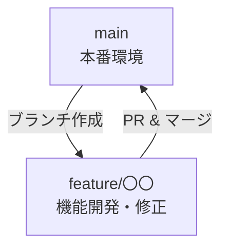

# CONTRIBUTING.md

このドキュメントは、人間のコントリビュータがこのリポジトリで作業する際のガイドです。

AI エージェント向けの手順は以下を参照してください：
- `AGENTS.md`: 全AI共通のガイドライン
- `CLAUDE.md`: Claude Code 向け補足
- `.github/copilot-instructions.md`: GitHub Copilot 向けインストラクション

全員が共通で従う恒久ルールは `RUNBOOK.md` に記載されています。

## 基本方針

### 人間の役割
- **重要な意思決定**: アーキテクチャ選択、仕様の判断、優先順位の決定
- **計画の策定**: PLAN.md の作成と更新
- **ルールの管理**: RUNBOOK.md を最新状態に保つ
- **レビューと承認**: AIが作成したコードの品質確認
- **本番操作**: 本番環境に影響する操作の最終承認

### 開発の基本ルール
- すべての変更は Pull Request 経由でレビューを受ける
- 本番環境に影響する操作（デプロイ、リソース削除など）はレビューと承認を得てから実施
- RUNBOOK に記載されていない新しいルールは、チームで合意してから追加する

## ブランチ戦略

### シンプルなフロー

小規模〜中規模プロジェクト向けに、シンプルなブランチ戦略を推奨します：



大規模プロジェクトの場合は、`develop` ブランチを追加してGit Flowを採用することも検討してください。

### ブランチ運用ルール

1. **`main` ブランチ**: 本番環境にデプロイ済みのコード
   - 直接コミット禁止
   - すべての変更は PR 経由でマージ

2. **`feature/*` ブランチ**: 機能追加や修正作業用
   - `main` から派生し、完了後 `main` へマージ
   - 命名例: `feature/add-user-auth`, `feature/fix-api-error`

3. **AI 作業ブランチ**: AI エージェントが作業する場合
   - 命名形式: `<agent-name>/<作業内容>`
   - 例: `claude/add-budget-alert`, `copilot/refactor-components`
   - 人間のレビューを必ず受けてから `main` へマージ

4. **その他のブランチ**（必要に応じて）:
   - `hotfix/*`: 緊急バグ修正
   - `docs/*`: ドキュメント更新のみ

### ブランチ作成手順

```bash
# 機能開発ブランチ（人が作業）
git checkout main
git pull origin main
git checkout -b feature/add-budget-alert

# AI 作業ブランチ（Claude が作業）
git checkout main
git pull origin main
git checkout -b claude/add-budget-alert
```

### コミットメッセージ

日本語で記述し、目的と影響が分かるようにする

フォーマット例:
```
[add] 予算アラートを追加
[fix] 通知チャネルの設定を修正
[chore] Terraform フォーマットを整理
```

### Pull Request

PR では以下を必ず記載:
- 概要・背景
- 変更内容
- テスト結果（`mise run tf:plan` など）
- 影響範囲（どのリソースに影響するか）

## テストと品質チェック

Runbook の「リリースチェックリスト」で定義されたコマンドを実行し、結果を PR に添付:
- `mise run tf:fmt` - コード整形
- `mise run tf:validate` - 構文検証
- `mise run tf:plan` - 差分確認

## AI エージェントとの協働

### 効果的な依頼の仕方

AI エージェントへ依頼する際は、以下を明確にすると効果的です：

1. **目的**: なぜこの作業が必要なのか
2. **期待する成果物**: 何を作って欲しいのか
3. **制約条件**: 守るべきルールや技術的制約
4. **現在のフェーズ**: PLAN.md のどのフェーズにいるか

**例**:
```
【目的】ユーザー認証機能を追加したい
【成果物】JWT認証を使ったログインAPI
【制約】既存のExpressサーバーに追加、TypeScriptで実装
【フェーズ】PLAN.md のフェーズ2を実装中

PLAN.md を確認して、実装をお願いします。
```

### AI の成果物をレビューする

AI エージェントが作成した成果物は、人が必ずレビューしてください：

- **コード品質**: 可読性、保守性、テストカバレッジ
- **セキュリティ**: 認証情報の扱い、脆弱性の有無
- **RUNBOOK との整合性**: 恒久ルールに従っているか
- **ドキュメント更新**: コード変更に対応したドキュメント更新がされているか

### 恒久ルールの追加

エージェントが恒久ルールを変更しようとする場合：
1. エージェントは「RUNBOOK に追記しますか？」と確認する
2. 人が必要性を判断し、YES/NO を返す
3. YES の場合、エージェントが RUNBOOK.md を更新
4. 人がレビューして承認する

## セキュリティ・コンプライアンス

- 秘密情報（鍵・パスフレーズ・個人情報）を Git に含めない
- IAM 権限やネットワーク構成を変更する場合は事前に関係者へ共有し、影響範囲をドキュメント化

## リリースと運用

1. PR が承認され、Runbook のリリースチェックを満たしていることを確認
2. `main` にマージ後、必要に応じて `mise run tf:apply` を実施（実施記録を残す）
3. 変更内容と運用手順の更新点を Runbook または関連ドキュメントに記載し、チームへ共有

## 変更提案

改善アイデアや新しいルールを提案する場合は Issue またはディスカッションを作成し、背景・目的・影響を整理した上で合意形成を行ってください。合意後は Runbook や関連ドキュメントを更新します。
